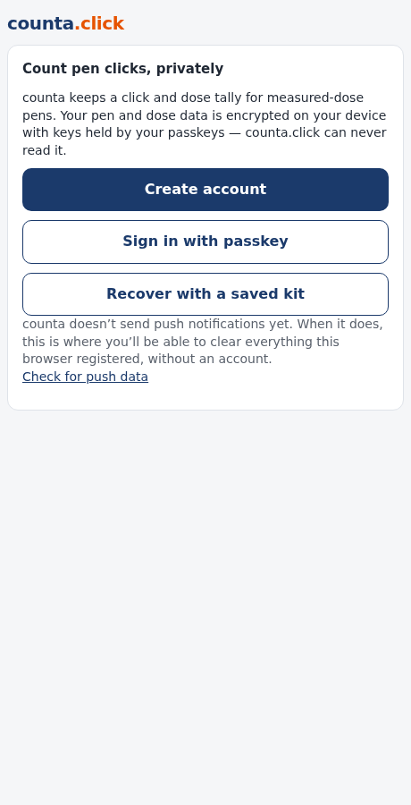
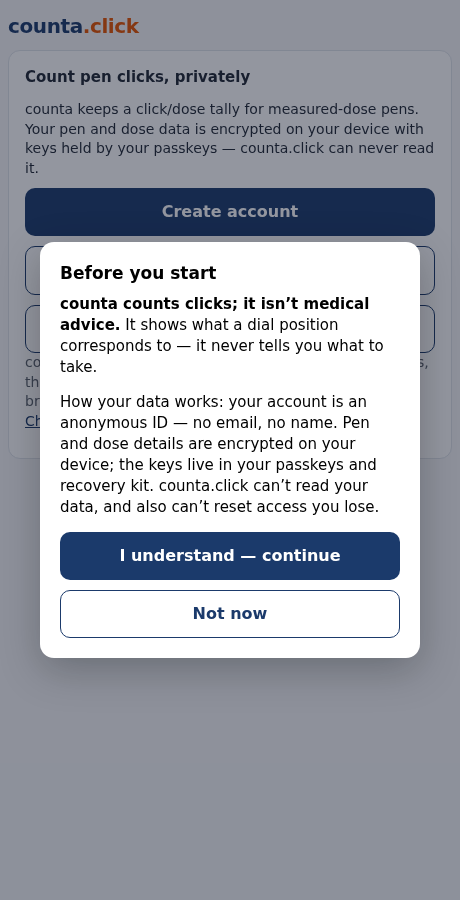
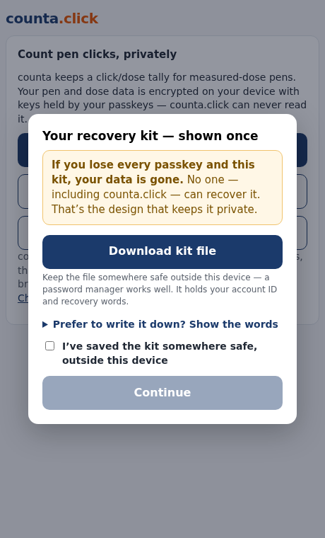
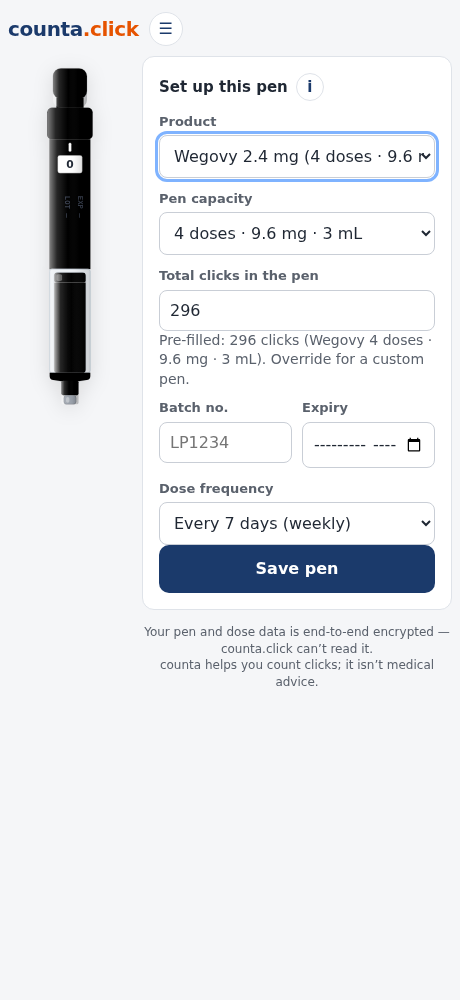
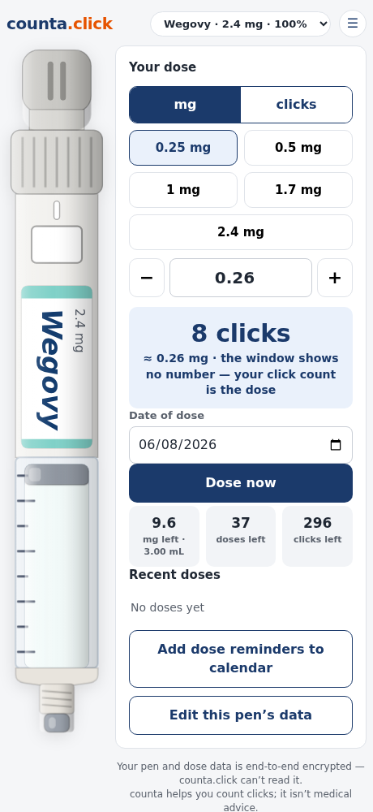
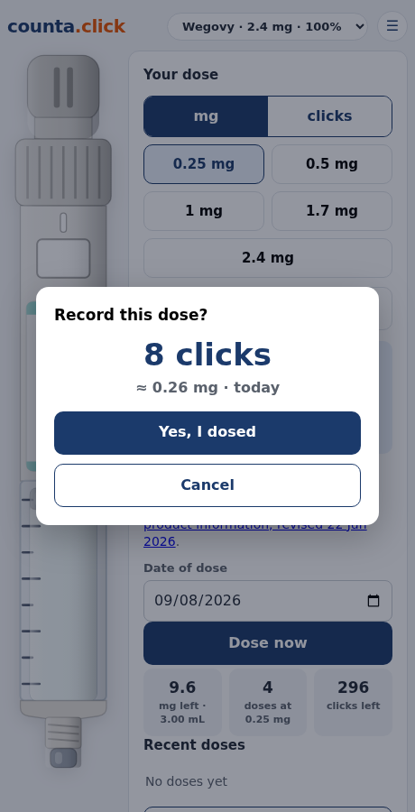
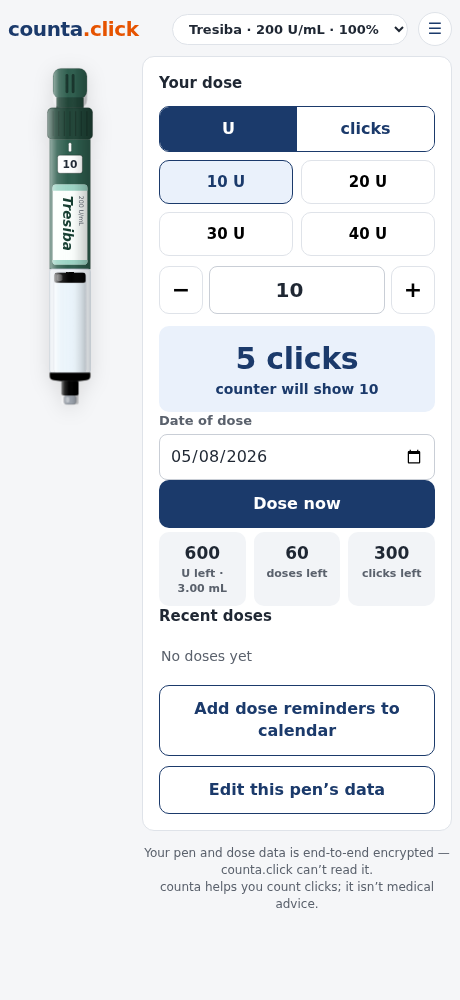
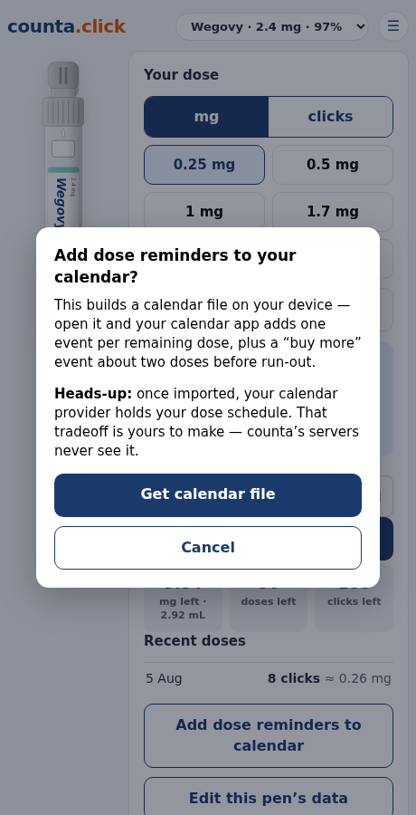
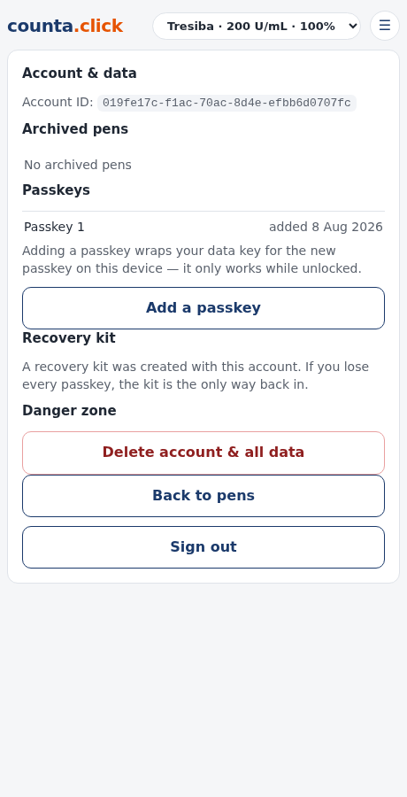
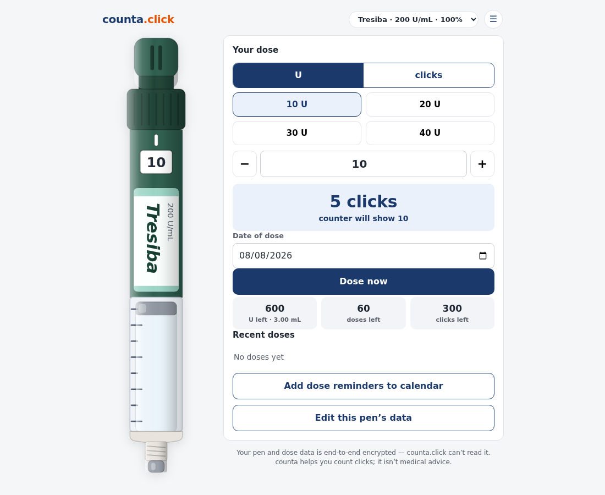

# Reviewer's guide — the first cut

This exists so a reviewer can start from *why*, not from a 4,500-line diff. It
covers the decisions that are hard to reverse later, the ones where the code
looks odd until you know the constraint, and the places where this PR
knowingly stops short.

Design authority lives in [`data-privacy.md`](data-privacy.md) (crypto, data
map, threat model) and [`design-notes.md`](design-notes.md) (UI rules). The
boundary map is [`repo-map.md`](repo-map.md). Where those and this disagree,
they win.

## Read the diff in this order

1. `docs/data-privacy.md` — what the product promises.
2. `app/javascript/crypto.js`, `auth.js`, `passkeys.js` — how it keeps it.
3. `app/controllers/**` — what the server is allowed to know.
4. `app/javascript/app.js`, `ics.js` — the UI and dose arithmetic.
5. `spec/**` — whether any of the above is actually proven.

`main` already contains the unmodified `rails new` output as its own commit, so
nothing in this diff is framework boilerplate.

## The one-paragraph version

Counta counts the *clicks* you dial on a measured-dose pen. An account is an
anonymous UUID with no email, name or password; you sign in with a passkey.
That passkey also produces the encryption key: everything about your pens and
doses is encrypted in your browser, and the server stores ciphertext it has no
way to open. Losing every passkey and the recovery kit means losing the data —
that is the deliberate cost of the operator being unable to read it.

---

## Decision 1 — Passkey PRF, and no passphrase fallback

**What.** Each passkey's WebAuthn PRF output is run through HKDF into a
key-encrypting key, which wraps a per-account data key (the DEK). The DEK
encrypts pen blobs with AES-256-GCM. The server holds one wrapped DEK per
credential, plus one wrapped by the recovery kit.

**Why no fallback.** A passphrase would be the weakest link and would
reintroduce exactly the guessable secret passkeys remove. So PRF is a hard
requirement, and an authenticator without it is refused at signup with copy
steering toward a platform passkey.

**How it's proven.** PRF support in the test harness was the only real unknown
in this build, so it was probed in isolation before any dependent code was
written. `spec/system/crypto_envelope_spec.rb` then drives the whole envelope
against real Chromium and a CDP virtual authenticator: register → unlock → add
a second passkey → recover from the kit → decrypt, asserting at each step that
the server holds only ciphertext.

**Non-obvious bits a reviewer will trip on.**

- Registration is `create()` *plus* an immediate local `get()`. PRF can only be
  evaluated during an assertion, and that output never goes near the server.
- `prf.enabled` from `create()` is treated as a fast path, never as proof —
  real providers report it inconsistently (1Password on iOS did, in testing).
  Only an assertion that yields no PRF output means "unsupported".
- Enrolling a second passkey for the same account on the *same* authenticator
  replaces the first, because resident credentials are keyed by (rpId,
  userHandle). Server credential rows and authenticator credentials are not
  1:1. AGENTS.md §9.1.

## Decision 2 — One encrypted blob per pen, not a row per dose

Row counts and timestamps are themselves health data: with a row per dose, the
number of rows and their spacing reconstructs someone's dosing rhythm even if
every field is encrypted. A blob per pen makes logging a dose indistinguishable
from any other write.

**The cost, and how it's paid:** a write carries a pen's whole dose log, so a
stale second device would overwrite all of it — and the server can't help,
having no keys. Writes therefore state the version they were based on; the
server rejects a superseded write with 409 and returns the winning row, and the
client merges the two histories by dose id before retrying once. Doses carry a
stable id for exactly that reason: two identical doses on the same day are
otherwise indistinguishable from the same dose seen twice.

A related leak survives: ciphertext length grows with the number of doses, so
blob size approximates a dose count. Padding is the fix and is filed.

## Decision 3 — Clicks are canonical; units are derived display

Some pens don't map 1:1 from click to dose unit — a Tresiba U200 delivers 2 U
per click. So the data model stores clicks and derives milligrams or units for
display, and the readout always leads with clicks, the thing you physically do
to the pen.

This is also where the most dangerous bug of the review lived. Products carry a
`counter_style`:

- `numeric` — the pen's window shows a real number, so copy says "counter will
  show 12".
- `progress` — the window is a blank scroll between 0 and full (Wegovy), so the
  click count is the *only* measure, and copy must never imply otherwise. The
  pen graphic's counter window is deliberately blank for these.

The calendar export originally said "counter set to N **clicks**" for every
pen. On a Tresiba that invites dialling until the window reads the click count
— half the intended insulin dose. Exported text is read months later without
the app open, so it now branches on `counter_style` and says what the window
will actually show. `spec/system/ics_and_account_spec.rb` pins it.

## Decision 4 — The server owns every date

Dates crossing the wire are UTC ISO 8601; the browser only formats them for the
viewer. Deadlines are computed server-side with ActiveSupport.

This followed a bug where the browser computed a retention deadline and
`toISOString()` shifted it a day for anyone off UTC. Archive state is now a
server-stamped `archived_at`, the two-year deadline is derived from it and
never stored, and the client sends only an intent. Re-saving an archived pen
can't restart the clock (`spec/requests/pens_archive_spec.rb`).

Related: `<time datetime>` is emitted alongside the human-readable date, so
tests assert the machine-readable instant instead of locale-formatted text.
That was a real CI failure — a US runner renders "Mar 9, 2025" where an AU box
renders "9 Mar 2025".

## Decision 5 — Owner scoping is the tenancy boundary

Every pen read and write goes through `current_account.pens`; a cross-account
ID gets a 404. This is R-001 and has a regression spec with a positive control.
The only unscoped path that touches pen data is the retention sweep, which has
no requesting user — that's R-004, and it selects purely on the plaintext
archive marker, never on ciphertext.

## What this PR does *not* do

Stopping points are deliberate and tracked as issues rather than hidden:

- **Pen registry / recall push** — table is migrated, matching and push are
  not built. The UI says so.
- **Push notifications** — the device-flush endpoint is a stub. The button
  says so rather than claiming a deletion.
- **Idle-account deletion** — policy decided, nothing built.
- **A scheduler** — the retention sweep is best-effort, running when someone
  lists their pens. Not called "automatic" anywhere.
- **Rate limiting** — R-003.
- **Backups** — hence no retention promise in the delete dialog.

## Security notes worth a second opinion

- **Web-delivered E2EE has a ceiling** (R-006). The crypto is served by the
  server it defends against, so an attacker who can change the served
  JavaScript gets keys at the next unlock. No client-side design fixes this;
  the threat model now says so instead of implying otherwise.
- **CSP raises the bar for getting script to run; it is not containment once
  it does.** `connect-src 'self'` blocks the obvious `fetch()` exfiltration
  path but does not stop top-level navigation carrying data in a URL, so an
  executing script can still get plaintext out. One XSS is still total
  compromise here — the CSP is defence in depth on top of escaping, not a
  boundary to lean on. (The nonce is per-request random: a session-derived
  nonce is empty before a session exists and silently blocks all JS.)
- **`development` is publicly reachable** at counta.click for pre-deploy
  testing, which it isn't built for (R-005). web-console is denied there;
  the real answer is running production mode.
- **User verification** is now enforced server-side. webauthn-ruby only checks
  the UV flag when you pass `user_verification: true`; asking for it in the
  options proves nothing, because the client is the attacker's.

## Screenshots

First run — disclaimer, then the recovery kit shown once (words behind a
toggle, file download as the primary action):

| Landing | Disclaimer | Recovery kit |
|---|---|---|
|  |  |  |

Daily use — setup is a one-time flow; the dose screen leads with clicks and
carries the `progress`-pen wording:

| Pen setup | Dose screen | Confirm |
|---|---|---|
|  |  |  |

A second medication (insulin, `numeric` counter — note "counter will show"),
the calendar caveat, and the account panel:

| Insulin pen | Calendar export | Account & data |
|---|---|---|
|  |  |  |

Desktop:



These are generated from the running app, not mocked:

```sh
SCREENSHOTS=1 mise exec -- bundle exec rspec spec/system/screenshots_spec.rb
```
