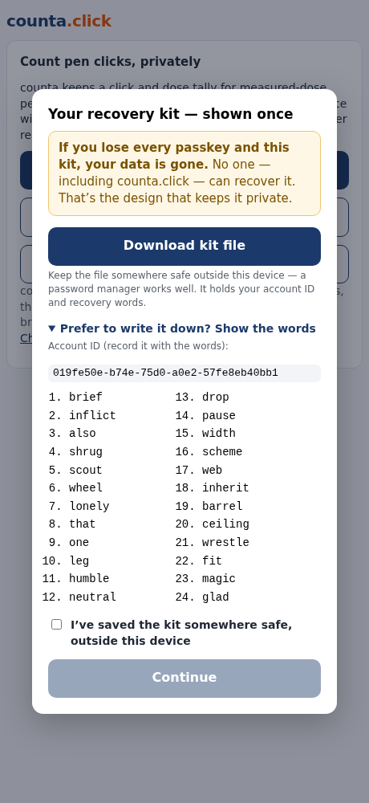

# UI tour

What each screen is for, and what it looks like. Generated from the running
app rather than mocked, so these can't drift from what it renders:

```sh
SCREENSHOTS=1 mise exec -- bundle exec rspec spec/system/screenshots_spec.rb
```

Design rules behind these screens live in [`design-notes.md`](design-notes.md);
the reasoning behind the data model is in [`architecture.md`](architecture.md).

## First run

Signing up is a first-time flow, not just a passkey ceremony. The disclaimer
carries the descriptive-tool framing and a plain-language summary of the data
model *before* an account exists, because the recovery-kit warning that follows
only makes sense if you already know nobody can read or reset your data.

| Landing | Disclaimer | Recovery kit |
|---|---|---|
|  |  |  |

The kit is shown **once**. The file download is the primary action and the 24
words sit behind a toggle — the words are there for anyone who wants a paper
copy, but leading with them made the ceremony feel long, and a QR code was
dropped entirely because nothing consumes it (a phone camera just web-searches
the payload).



## Setting up a pen

A one-time flow. The pen graphic flips to its back, which *is* the mode
transition — the graphic is the constant anchor of the interface, not
decoration.


Total clicks pre-fills from the product but stays overridable, because a pen
that isn't in the list still needs to be countable. An unlisted pen is also
asked whether its counter shows a readable number, since counta can't know —
and guessing wrong would tell someone to dial to a number their pen never
displays.

## Daily use

The dose screen leads with **clicks**, the thing you do to the pen, with the
derived milligrams underneath. This pen is `progress`-style, so the copy says
the window shows no number rather than implying a reading it can't give.

| Dose screen | Confirm | Calendar export |
|---|---|---|
|  |  | |

The calendar dialog is explicit that your calendar provider ends up holding the
schedule — a real tradeoff, and the user's to make, so it's stated rather than
buried.

## More than one medication

The header chip is the pen switcher and the way to add another pen. This one is
an insulin pen with a `numeric` counter, so its copy reads "counter will show"
— compare with the Wegovy screen above.


## Account and data

One panel: passkeys, archived pens, and delete-everything. Adding a passkey
only works while unlocked, because the data key has to be in memory to wrap for
the new credential.


## Desktop

Same screens, wider layout.


